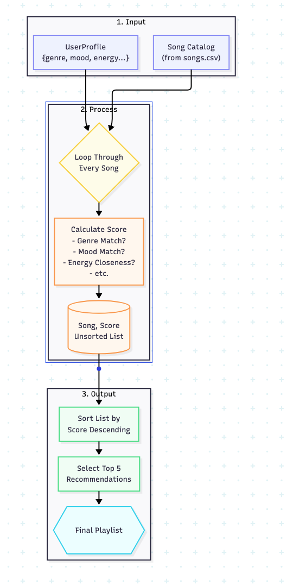

# 🎵 Music Recommender Simulation

## Project Summary

In this project you will build and explain a small music recommender system.

Your goal is to:

- Represent songs and a user "taste profile" as data
- Design a scoring rule that turns that data into recommendations
- Evaluate what your system gets right and wrong
- Reflect on how this mirrors real world AI recommenders

Replace this paragraph with your own summary of what your version does.

---

## How The System Works

This recommender system works by implementing a **content-based filtering** approach. It matches songs from a catalog to a user's taste profile based on the songs' intrinsic characteristics. The core idea is to score every song against the user's preferences and then rank them to find the best matches.

- **What features does each `Song` use in your system?**
  - Our system uses a mix of categorical and numerical features to define each song:
    - **Categorical:** `genre` (e.g., pop, rock, lofi) and `mood` (e.g., happy, chill, intense).
    - **Numerical:** `energy`, `valence` (musical positiveness), and `danceability`. These are measured on a scale from 0.0 to 1.0.

- **What information does your `UserProfile` store?**
  - The `UserProfile` stores the user's ideal musical preferences. This includes their preferred `genre` and `mood`, as well as target values for the numerical features (`energy`, `valence`, and `danceability`). For example, a user might prefer `lofi` music with a `chill` mood and `low energy`.

- **How does your `Recommender` compute a score for each song?**
  - The recommender calculates a total "match score" for each song using a weighted formula:
    1.  **Categorical Match:** Songs get a full score for matching the user's preferred `genre` and `mood`, and zero otherwise.
    2.  **Numerical Match:** For features like `energy`, the score is calculated based on *closeness* to the user's preference using the formula: `Score = 1 / (1 + |User Preference - Song Value|)`. This rewards songs that are closer to the user's target value.
    3.  **Weighted Total:** The final score is a weighted sum of the individual feature scores. `genre` and `mood` are weighted most heavily, as they are the strongest indicators of taste.
        - `genre_weight`: 40
        - `mood_weight`: 30
        - `energy_weight`, `valence_weight`, `danceability_weight`: 10 each

- **How do you choose which songs to recommend?**
  - After scoring every song in the catalog against the user's profile, the system applies a **Ranking Rule**. It sorts all the songs in descending order based on their final score. The top-scoring songs are then presented to the user as the final recommendation list.

- **Diagram of workflow:**
  
---

## Getting Started

### Setup

1. Create a virtual environment (optional but recommended):

   ```bash
   python -m venv .venv
   source .venv/bin/activate      # Mac or Linux
   .venv\Scripts\activate         # Windows

2. Install dependencies

```bash
pip install -r requirements.txt
```

3. Run the app:

```bash
python -m src.main
```

### Running Tests

Run the starter tests with:

```bash
pytest
```

You can add more tests in `tests/test_recommender.py`.

---

## Sample Recommendation Output

Paste a sample of your recommender's output here as a text block so a reader can see what it produces:

```
# e.g.:
# User profile: genre=indie, mood=chill, energy=low
# Recommendations:
#   1. ...
#   2. ...
#   3. ...
```

**Screenshot or video** *(optional)*: <!-- Insert a screenshot or demo video link here -->

---

## Experiments You Tried

Use this section to document the experiments you ran. For example:

- What happened when you changed the weight on genre from 2.0 to 0.5
- What happened when you added tempo or valence to the score
- How did your system behave for different types of users

---

## Limitations and Risks

Summarize some limitations of your recommender.

Examples:

- It only works on a tiny catalog
- It does not understand lyrics or language
- It might over favor one genre or mood

You will go deeper on this in your model card.

---

## Reflection

Read and complete `model_card.md`:

[**Model Card**](model_card.md)

Write 1 to 2 paragraphs here about what you learned:

- about how recommenders turn data into predictions
- about where bias or unfairness could show up in systems like this


